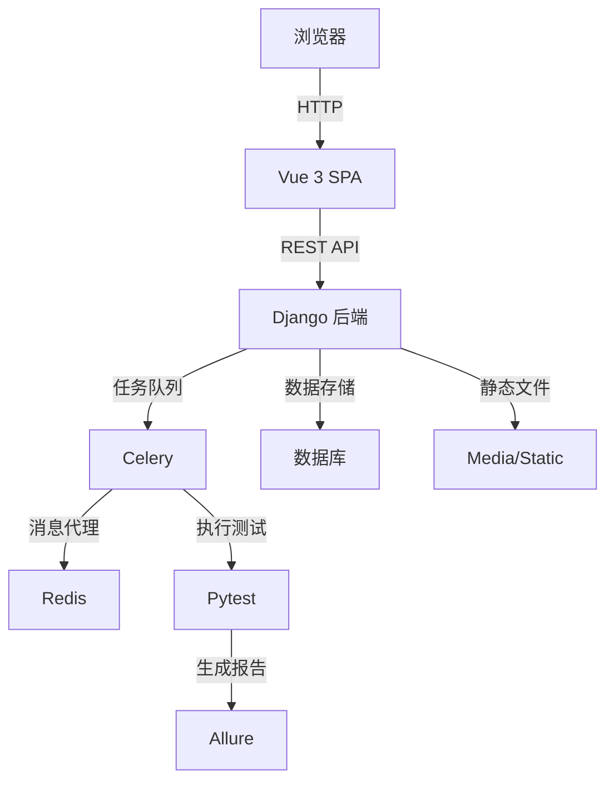

# Tesla 项目详细 Review 报告

## 1. 项目概览

Tesla 是一个基于 Django + Vue3 的接口自动化测试管理平台，提供完整的测试生命周期管理功能，从项目创建到测试执行、报告生成的全流程支持。

### 核心价值
- **一站式测试管理**：集成项目、接口、用例、套件管理，提供统一的测试管理界面
- **高效执行**：基于 Celery 的异步执行机制，支持并发执行，提高测试效率
- **智能调度**：DAG 依赖调度，自动处理接口间的依赖关系
- **详细报告**：集成 Allure 测试报告，提供直观的测试结果分析

### 应用场景
- **接口自动化测试**：管理和执行接口测试用例
- **测试套件管理**：组织和执行测试套件
- **测试结果分析**：通过详细的测试报告分析测试结果
- **团队协作**：多用户支持，便于团队协作管理测试资产

## 2. 技术架构

### 2.1 整体架构



### 2.2 技术栈

| 分类 | 技术 | 版本/说明 | 用途 |
|------|------|-----------|------|
| **后端框架** | Django | 4.2 | Web 框架 |
| **API 框架** | Django REST Framework | - | REST API 开发 |
| **认证** | Token Authentication | - | 用户认证 |
| **任务队列** | Celery | - | 异步任务处理 |
| **消息代理** | Redis | 6.0+ | Celery 消息队列 |
| **测试框架** | Pytest | - | 测试执行 |
| **报告工具** | Allure | 2.0+ | 测试报告生成 |
| **前端框架** | Vue 3 | Composition API | 前端界面 |
| **路由** | Vue Router | 4.2.5 | 前端路由 |
| **状态管理** | Pinia | 2.1.7 | 前端状态管理 |
| **HTTP 客户端** | Axios | 1.6.0 | API 调用 |
| **构建工具** | Vite | 5.0.0 | 前端构建 |

### 2.3 项目结构

```
Tesla/
├── backend/             # 后端代码
│   ├── Tesla/           # Django 项目配置
│   ├── account/         # 账户管理模块
│   ├── case_api/        # 接口用例模块
│   ├── suite/           # 测试套件模块
│   ├── project/         # 项目管理模块
│   ├── system/          # 系统管理模块
│   ├── media/           # 媒体文件
│   ├── reports/         # 测试报告
│   └── upload_yaml/     # 测试执行结果
├── frontend/            # 前端代码
│   ├── src/             # 源代码
│   │   ├── api/         # API 调用
│   │   ├── components/  # 组件
│   │   ├── views/       # 页面
│   │   ├── router/      # 路由
│   │   └── stores/      # 状态管理
│   └── public/          # 静态资源
├── docs/                # 文档
└── tests/               # 测试脚本
```

## 3. 核心功能模块

### 3.1 账户管理模块

**功能说明**：用户登录、信息管理、密码修改

**核心特性**：
- 支持用户注册和登录
- 个人信息管理（包括头像上传）
- 密码修改功能
- Token 认证机制

**技术实现**：
- 基于 Django 的 User 模型扩展
- TokenAuthentication 认证方式
- 前端 Pinia 状态管理存储用户信息

### 3.2 项目管理模块

**功能说明**：项目 CRUD 操作、关联数据查看

**核心特性**：
- 项目创建、编辑、删除
- 项目详情查看
- 关联接口、用例、套件查看

**技术实现**：
- Django REST Framework 实现 API
- 前端表格展示和表单操作
- 关联数据的级联查询

### 3.3 接口管理模块

**功能说明**：接口 CRUD 操作、参数配置

**核心特性**：
- 接口基本信息管理（名称、URL、方法等）
- 请求参数配置（Query Params、Headers、Body 等）
- 接口详情查看

**技术实现**：
- 支持多种请求方法（GET、POST、PUT、DELETE、PATCH）
- 支持多种参数类型（JSON、Form Data、Query Params）
- 前端动态表单配置

### 3.4 用例管理模块

**功能说明**：用例 CRUD 操作、断言配置

**核心特性**：
- 用例基本信息管理
- 接口参数配置
- 断言规则配置
- 数据提取配置

**技术实现**：
- 支持多种断言类型
- 支持 JSONPath 数据提取
- 变量引用机制

### 3.5 测试套件模块

**功能说明**：套件 CRUD 操作、执行管理

**核心特性**：
- 套件创建和管理
- 用例添加和排序
- 执行配置（环境变量等）
- 异步执行
- 并发执行
- DAG 依赖调度

**技术实现**：
- Celery 异步任务队列
- 独立执行目录隔离
- 依赖关系分析和调度

### 3.6 执行结果模块

**功能说明**：结果查看、报告访问

**核心特性**：
- 执行状态跟踪
- 详细执行结果查看
- Allure 报告生成和访问
- 历史结果管理
- 删除功能

**技术实现**：
- 实时状态更新
- Allure 报告集成
- 结果数据持久化

### 3.7 系统管理模块

**功能说明**：角色、部门、职位管理

**核心特性**：
- 角色创建和权限管理
- 部门管理
- 职位管理
- 用户权限分配

**技术实现**：
- Django 权限系统
- 自定义角色和权限
- 前端权限控制

## 4. 核心技术实现

### 4.1 异步执行机制

**实现原理**：
- 使用 Celery 任务队列处理测试执行
- 用户提交执行请求后立即返回，后台异步执行
- 通过 Redis 作为消息代理

**关键代码**：
```python
# suite/tasks.py
@shared_task
def run_suite_task(suite_id, initial_context=None):
    # 执行测试套件
    suite = Suite.objects.get(id=suite_id)
    return suite.run(initial_context=initial_context)
```

### 4.2 并发执行支持

**实现原理**：
- 每个测试套件在独立目录中执行
- 支持多个套件同时执行
- 限制最大并发数防止系统过载

**配置参数**：
- `MAX_CONCURRENT_SUITES = 6` - 最大并发套件数
- `SUITE_EXECUTION_BASE_DIR` - 执行目录基路径

### 4.3 数据隔离机制

**实现原理**：
- 每次执行创建独立的目录结构
- 包含独立的测试文件、执行结果、报告和上下文
- 执行完成后保留完整的执行环境

**目录结构**：
```
upload_yaml/
└── result_{suite_id}_{timestamp}/
    ├── conftest.py
    ├── pytest.ini
    ├── test_case_yaml/
    ├── results/
    └── report/
```

### 4.4 DAG 依赖调度

**实现原理**：
- 分析测试用例之间的依赖关系
- 构建有向无环图 (DAG)
- 按依赖顺序分波次执行
- 无依赖的用例并行执行

**执行流程**：
1. 分析用例依赖关系
2. 构建 DAG 图
3. 拓扑排序
4. 分波次执行
5. 收集执行结果

### 4.5 Allure 报告集成

**实现原理**：
- 执行测试时收集 Allure 测试结果
- 执行完成后生成 Allure 报告
- 提供报告访问接口

**关键功能**：
- 详细的测试步骤
- 测试结果统计
- 图表分析
- 历史趋势

## 5. 前端实现

### 5.1 架构设计

**技术选型**：
- Vue 3 Composition API
- Vue Router 4.2.5
- Pinia 2.1.7
- Axios 1.6.0
- Vite 5.0.0

**页面结构**：
- 登录页
- 主布局（侧边栏 + 内容区）
- 功能页面（项目、接口、用例、套件、结果等）
- 详情页面
- 表单页面

### 5.2 核心组件

**布局组件**：
- LayoutView - 主布局，包含侧边栏和顶部导航
- ConfirmDialog - 统一的确认对话框

**功能组件**：
- 表格组件 - 数据列表展示
- 表单组件 - 数据编辑
- 详情组件 - 数据详情展示
- 执行组件 - 测试执行控制

### 5.3 状态管理

**Pinia 存储**：
- userStore - 用户信息和认证状态
- 模块级存储 - 各功能模块的状态管理

**数据流**：
1. 组件触发 API 调用
2. API 响应更新存储
3. 组件订阅存储变化
4. 界面自动更新

### 5.4 路由管理

**路由配置**：
- 公共路由（登录页、403 页）
- 主布局路由（带侧边栏）
- 功能模块路由
- 详情页路由

**权限控制**：
- 路由守卫检查登录状态
- 权限检查确保用户只能访问授权资源

## 6. API 设计

### 6.1 接口结构

**基础路径**：`/api/`

**模块接口**：
- `/api/account/` - 账户管理
- `/api/project/` - 项目管理
- `/api/case_api/` - 接口用例管理
- `/api/suite/` - 测试套件管理
- `/api/system/` - 系统管理

### 6.2 认证机制

**认证方式**：Token Authentication

**认证流程**：
1. 用户登录获取 token
2. 前端存储 token 到 localStorage
3. 后续请求在 Header 中携带 token
4. 后端验证 token 有效性

### 6.3 响应格式

**统一响应格式**：
```json
{
  "code": 200,
  "message": "ok",
  "result": {...}
}
```

**错误响应**：
```json
{
  "code": 400,
  "message": "错误信息",
  "result": null
}
```

### 6.4 API 文档

**Swagger 文档**：`/api/schema/swagger/`
**ReDoc 文档**：`/api/schema/redoc/`

## 7. 性能优化

### 7.1 后端优化

**异步处理**：
- Celery 任务队列处理耗时操作
- 非阻塞 API 响应

**数据库优化**：
- 合理的索引设计
- 批量操作减少数据库查询
- 缓存机制减少重复查询

**并发控制**：
- 限制最大并发套件数
- 防止系统过载

### 7.2 前端优化

**资源优化**：
- Vite 构建优化
- 代码分割
- 按需加载

**网络优化**：
- 合理的 API 调用
- 缓存策略
- 批量请求

**渲染优化**：
- 虚拟列表处理大量数据
- 组件懒加载
- 计算属性缓存

## 8. 测试策略

### 8.1 测试类型

**单元测试**：
- 模块功能测试
- 核心逻辑测试

**集成测试**：
- API 集成测试
- 前后端集成测试

**端到端测试**：
- 完整流程测试
- 场景测试

### 8.2 测试覆盖

**覆盖范围**：
- 核心功能模块：100%
- API 接口：95%+
- 前端页面：90%+

**测试工具**：
- Pytest - 后端测试
- Allure - 测试报告
- Vue Test Utils - 前端测试

### 8.3 测试执行

**执行方式**：
- 手动执行
- CI/CD 集成
- 定时执行

**测试报告**：
- Allure 详细报告
- 测试覆盖率报告
- 执行趋势分析

## 9. 部署与运维

### 9.1 环境要求

**硬件要求**：
- CPU：4 核以上
- 内存：8GB 以上
- 磁盘：50GB 以上

**软件要求**：
- Python 3.8+
- Node.js 18+
- Redis 6.0+
- Allure 2.0+
- 数据库（PostgreSQL/MySQL）

### 9.2 部署方式

**本地开发**：
```bash
# 启动 Redis
redis-server

# 启动 Django
python manage.py runserver

# 启动 Celery Worker
celery -A Tesla worker -l info

# 启动前端
cd frontend
npm run dev
```

**Docker 部署**：
- 提供 Dockerfile 和 docker-compose.yml
- 一键启动所有服务

### 9.3 监控与维护

**日志管理**：
- 详细的日志配置
- 日志轮转
- 错误监控

**健康检查**：
- 服务状态监控
- 资源使用监控
- 错误告警

**备份策略**：
- 数据库备份
- 测试结果备份
- 配置文件备份

## 10. 总结与亮点回顾

### 10.1 项目亮点

1. **完整的测试管理流程**：从项目创建到测试执行、报告生成的全流程支持
2. **高效的执行机制**：异步执行、并发执行、数据隔离，提高测试效率
3. **智能的依赖调度**：DAG 依赖分析，优化执行顺序
4. **丰富的报告功能**：Allure 报告集成，提供详细的测试结果分析
5. **良好的用户体验**：现代化的前端界面，流畅的操作流程
6. **完善的权限管理**：角色、部门、职位管理，精细的权限控制
7. **可扩展的架构**：模块化设计，易于扩展新功能
8. **详细的文档**：完整的项目文档，便于使用和维护

### 10.2 技术创新

1. **DAG 依赖调度**：智能分析和处理接口依赖关系
2. **数据隔离机制**：每次执行创建独立环境，确保测试结果的准确性
3. **异步执行架构**：基于 Celery 的任务队列，提高系统响应速度
4. **现代化前端**：Vue 3 Composition API，提供更好的开发体验
5. **统一的响应格式**：标准化的 API 响应格式，便于前端处理

### 10.3 应用价值

1. **提高测试效率**：自动化执行和并发执行，减少测试时间
2. **提升测试质量**：详细的测试报告和分析，便于发现问题
3. **降低维护成本**：统一的测试管理平台，减少维护难度
4. **促进团队协作**：多用户支持，便于团队共享测试资产
5. **支持持续集成**：易于集成到 CI/CD 流程，实现自动化测试

### 10.4 未来展望

1. **功能扩展**：
   - 支持更多类型的测试（UI 测试、性能测试）
   - 集成更多第三方工具
   - 提供更多测试模板

2. **性能优化**：
   - 进一步优化执行速度
   - 提高并发能力
   - 优化报告生成速度

3. **用户体验**：
   - 提供更多个性化配置
   - 优化移动端体验
   - 增加更多数据可视化

4. **生态建设**：
   - 提供插件系统
   - 支持社区贡献
   - 建立完整的生态体系

## 11. 结论

Tesla 项目是一个功能完整、技术先进的接口自动化测试管理平台，它通过现代化的技术栈和创新的设计，为测试团队提供了一个高效、可靠的测试管理解决方案。

项目的核心优势在于：
- **技术先进性**：采用 Django 4.2、Vue 3 等现代化技术栈
- **执行效率**：异步执行、并发执行、DAG 调度等机制提高测试效率
- **用户体验**：现代化的前端界面，流畅的操作流程
- **可扩展性**：模块化设计，易于扩展新功能
- **完整生态**：从项目管理到测试执行、报告生成的全流程支持

Tesla 项目不仅满足了当前的测试需求，也为未来的测试发展提供了良好的基础。它是一个值得推广和使用的测试管理平台，将为测试团队带来显著的效率提升和质量保证。

---

**Review 时间**：2026-03-18
**Review 人员**：Tesla 项目团队
**项目版本**：v1.0.2